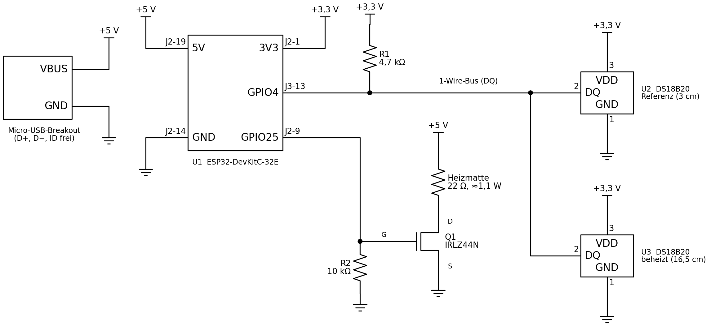
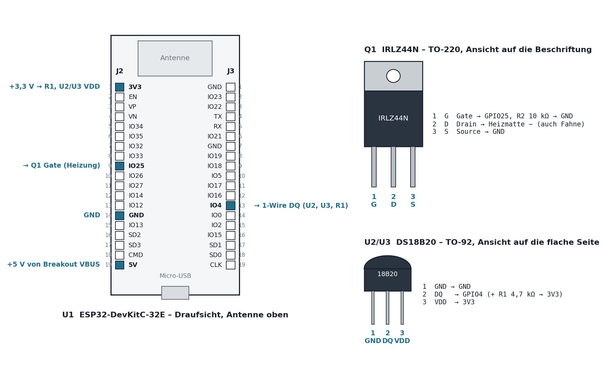

# Thermischer Leckagesensor (Clamp-on, ESPHome)

Nicht-invasiver Sensor, der Mikro-Leckagen ab ca. 0,5 L/h in einer Trinkwasserleitung erkennt – unterhalb der Anlaufschwelle üblicher Wasserzähler (5–10 L/h). Der Sensor wird außen auf das Rohr geklebt, die Leitung muss nicht aufgetrennt werden.

Aufgebaut an einer waagerechten Edelstahlleitung 35 mm AD mit 25 cm freier Länge, eingebunden in Home Assistant über ESPHome.

> Status: im Testbetrieb. Regel 1 (Mikroleck) ist mit 0,5 und 0,6–0,7 L/h verifiziert, Regel 2 (Dauerfluss) ist noch ungetestet.

## Prinzip

Eine Heizmatte gibt ca. 0,9 W auf das Rohr. Ein DS18B20 misst an der Heizstelle, ein zweiter die Referenz stromaufwärts:
ΔT = T_beheizt − T_Referenz.

Im Stillstand verteilt natürliche Konvektion im waagerechten Rohr die Wärme bis zur Referenz – ΔT stellt sich nur auf ca. 0,8–1,1 K ein. Ausgewertet wird deshalb das **zeitliche Muster** von ΔT, nicht der Absolutwert:

| Ereignis | Verlauf von ΔT (gemessen) |
| --- | --- |
| Ruhe | Plateau, Rauschen ±0,02 K |
| Zapfung (WC, Hahn) | fällt sprunghaft um 0,6–0,8 K, erholt sich in 30–60 min von unten |
| Mikroleck 0,5–0,7 L/h | springt in 5–10 min um +0,15–0,3 K aus dem Plateau; danach je nach Durchfluss erhöht oder leicht unter der Basis |

**Regel 1 – Mikroleck:** ΔT (Mittel der letzten 5 min) liegt 3 min lang mehr als 0,10 K über der gleitenden Basis (Mittel von 30–90 min zurück), und im Basisfenster gab es keine Entnahme (Schwankung < 0,10 K). Der Verdacht wird gespeichert und bleibt bis zur Quittierung in Home Assistant bestehen – auch über einen Neustart.

**Regel 2 – Dauerfluss:** ΔT liegt länger als 90 min mehr als 0,3 K unter der letzten Ruhebasis. Noch nicht durch eine Messung bestätigt.

Eine Mengenangabe in L/h liefert das Verfahren nicht.

| Eigenschaft | Wert |
| --- | --- |
| Erkennung Mikroleck | ab ca. 0,5 L/h |
| Reaktionszeit | ca. 5–10 min bis Verdacht und Alarm |
| Heizleistung | 0,94 W (22 Ω an 5 V, 80 % PWM) bzw. 1,14 W bei 100 % |
| Vorlauf nach Neustart / Heizung aus | 90 min |
| Leistungsaufnahme gesamt | ca. 1,5 W an 5 V (Heizung + ESP32) |

## Stückliste

| Teil | Spezifikation | Menge |
| --- | --- | --- |
| Heizmatte | RS PRO Polyimid 12 V / 5 W, 50 × 100 mm, selbstklebend (hier gemessen 22 Ω) | 1 |
| Mikrocontroller | ESP32-DevKitC-32E | 1 |
| Temperatursensor | DS18B20, TO-92 | 2 (+1 Reserve) |
| MOSFET | IRLZ44N (Logic Level) | 1 |
| Widerstände | 4,7 kΩ (1-Wire-Pull-up), 10 kΩ (Gate-Pulldown) | je 1 |
| Versorgung | Micro-USB-Breakout + USB-Netzteil ≥ 1 A | 1 |
| Isolierung | SH/ArmaFlex selbstklebend, 35 mm, 19 mm Dämmstärke | 25 cm |
| Kleinmaterial | Wärmeleitpaste, Kapton-Band, Alu-Band 50 mm, Schrumpfschlauch, Litze | – |

## Mechanischer Aufbau

```
  0     3                   14   16,5   19          25 cm
  |─────●───────────────────[████▲████]──────────|  → Fließrichtung
        Referenz            Heizmatte 50 mm
        (6 Uhr, unten)      ▲ = beheizter DS18B20 (12 Uhr, oben)
  └────────── ArmaFlex 19 mm, volle 25 cm, Nähte verklebt ──────────┘
```

1. Rohr entfetten. Heizmatte kalt messen (PWM-Pegel = 0,9 W × R / 25 V²).
2. DS18B20-Beinchen einzeln mit Schrumpfschlauch isolieren (Kondensat).
3. Referenz bei 3 cm unten (6 Uhr), mit Wärmeleitpaste, Kapton und Alu-Band.
4. Heizmatte bei 14–19 cm ringförmig aufkleben, 10 mm Spalt oben; beheizten Sensor mittig in den Spalt (12 Uhr), alles mit Alu-Band umwickeln.
5. Leitungen unter der Isolierung zum Austritt bei 0 cm führen, Isolierung über die vollen 25 cm luftdicht verkleben.
6. Elektronik an der Wand, nicht am Kaltwasserrohr.

## Verdrahtung



| Von | Nach | Hinweis |
| --- | --- | --- |
| Breakout VBUS | ESP32 5V (J2-19), Heizmatte + | |
| Breakout GND | ESP32 GND (J2-14), IRLZ44N Source, DS18B20 GND | gemeinsame Masse |
| Heizmatte − | IRLZ44N Drain | |
| IRLZ44N Gate | GPIO25 (J2-9) | 10 kΩ Gate → GND |
| DS18B20 VDD (beide) | 3V3 (J2-1) | |
| DS18B20 DQ (beide) | GPIO4 (J3-13) | 4,7 kΩ DQ → 3V3 |



- IRLZ44N, Ansicht auf die Beschriftung, Beine unten: Gate – Drain – Source.
- DS18B20, Ansicht auf die flache Seite, Beine unten: GND – DQ – VDD.
- Nie Breakout und die USB-Buchse des ESP32 gleichzeitig an Strom.

## Installation

1. `secrets.yaml.example` als Vorlage für die Secrets im ESPHome Builder verwenden.
2. `leak-thermal.yaml` in den ESPHome Builder übernehmen, einmal per USB flashen.
3. Im Log unter `Found devices` beide Sensoradressen ablesen, per Handwärme zuordnen und unter `substitutions` eintragen, neu flashen.
4. Gerät in Home Assistant einbinden (wird meist automatisch erkannt).
5. Automation aus `homeassistant/automation_leckage.yaml` anlegen, Entity-IDs prüfen.

## Inbetriebnahme

**Am Tisch**
1. Tischtest: beheizten Sensor auf die Matte kleben, Heizung an – an freier Luft steigt „Rohr beheizt“ um einige Kelvin; über 30 °C greift die Sicherheitsabschaltung binnen 60 s.
2. Offset: Heizung aus, beide Sensoren flach aneinander kleben, 60 min warten, „Offset kalibrieren“ drücken. „Rohr ΔT“ zeigt danach ≈ 0,00 K.

**Am Rohr**
1. Montieren, isolieren, Heizung an, 90 min Vorlauf.
2. Test Mikroleck: nach mind. 90 min ohne Entnahme einen Hahn auf ca. 0,5 L/h stellen. „Leckage-Verdacht Mikro“ geht nach 5–10 min auf *Problem* und bleibt dort. Danach „Leckverdacht quittieren“.
3. Test Dauerfluss (offen): ca. 3 L/h über 2 h.

Den Offset am Rohr nicht neu kalibrieren: Die Heizzone braucht nach dem Abschalten weit mehr als 90 min, und Temperaturschichtung im Rohr verfälscht den Wert. Für die Leckauswertung ist der Offset ohnehin unerheblich. Ein falsch gesetzter Offset lässt sich per HA-Aktion `esphome.leak_thermal_korrigiere_offset` verschieben.

## Entitäten in Home Assistant

| Entität | Bedeutung |
| --- | --- |
| Rohr ΔT | T_beheizt − T_Referenz − Offset, 2-min-Mittel |
| ΔT Basis (30–90 min) | Mittel von ΔT von vor 90 bis vor 30 min |
| ΔT Abweichung von Basis | aktuelles ΔT (5-min-Mittel) minus Basis – das eigentliche Messsignal |
| Ruhephase (Basis gültig) | An = im Basisfenster keine Entnahme; nur dann kann Regel 1 auslösen |
| Leckage-Verdacht Mikro | Problem = Sprung erkannt, bleibt bis Quittierung |
| Leckage-Verdacht Dauerfluss | Problem = > 90 min deutlich unter Ruhebasis |
| Leck-Schwelle Anstieg | Schwelle für Regel 1 (Standard 0,10 K) |
| Kalibrierung Offset | gespeicherter Sensor-Offset (Diagnose) |

## Grenzen

- Ein Leck, das während einer Zapfung beginnt, erzeugt keinen Sprung aus der Ruhe und wird von Regel 1 nicht erkannt. Abhilfe (geplant): nächtliches Plateau mit dem Median der letzten Nächte vergleichen.
- Regel 1 kann nur aus einer Ruhephase heraus auslösen (90 min ohne Entnahme).
- Die Kennlinie ist nicht monoton; Verhalten bei 1–5 L/h noch nicht gemessen.
- Trinkwasser: Die Heizung legt lokal ca. 1 K auf. Sicherheitsabschaltung bei 30 °C Rohrtemperatur.
- Kondensat: Isolierung dicht halten.

## Sicherheit

Die Heizleistung ist durch den Widerstand der Matte begrenzt (22 Ω an 5 V = max. 1,14 W). Zusätzlich schaltet die Firmware die Heizung bei > 30 °C oder Sensorausfall ab. Nutzung auf eigene Verantwortung.
